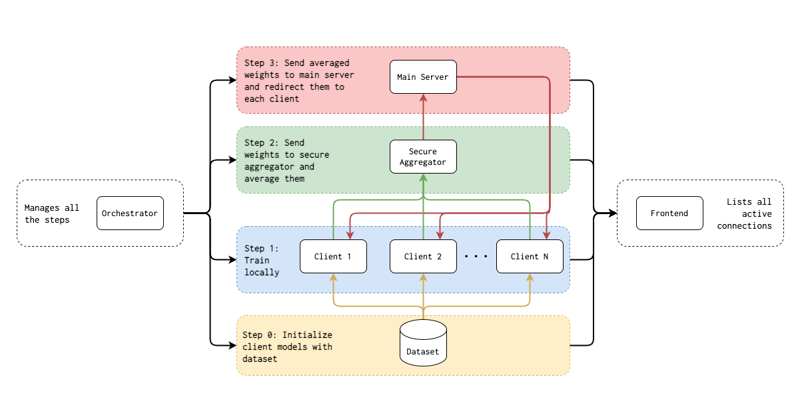

# Pytorch Federated Learning
This framework enables to use a FL system with Pytorch.

It is being carried as my final thesis @ [King's College London](https://www.kcl.ac.uk/).

It currently works with the [Human grasp dataset](http://stag.csail.mit.edu/). Repo [here](https://github.com/Erkil1452/touch).

## Scheme


Orchestrator process:


## Results

You can see the results of the experiments done [here](results/README.md).


## How to run

### Step 1. Copy the dataset locally

- Run the following commands:
    ```
    wget http://stag.csail.mit.edu/datasets/classification_lite.zip -O temp.zip
    unzip temp.zip -d data/classification/
    rm temp.zip
    ```

### Step 2. There are 3 main ways to run the program

1. Spawning Python with the shell script (Recommended).
    - Note: [screen](https://www.gnu.org/software/screen/) must be installed.
    - Change the `PYTHON_PATH` in the `initialize.sh` file to point to your python where all the requirements are installed.
    - Add or remove as many clients as desired in the `initialize.sh` file.
    - Attention! The number and ports of clients in the `initialize.sh` file should match the `hosts.yml` file.
    - Run the command: `DELETE_OLD_LOGS=1 RESTART_SCREEN=1 ./initialize.sh`
        - There are two env variables which can be set:
            - `DELETE_OLD_LOGS`: if set to 1, removes all logs in `logs/` folder. Useful for new run.
            - `RESTART_SCREEN`: if set to 1, kills all current screens. Useful for new run.
    - If you want to attach to a running screen, run the command `screen -S <screen_name>`.
    - If you want to dettach from a screen, when attached, run the commands `ctrl+A ctrl+D`.
    - If you want to kill to an exiting screen, when attached, run the commands `ctrl+A ctrl+K Y`.
    - All connections and training status will be visible (here)[http://104.197.103.25:8002/frontend].

2. Spawning Python manually (If screen not installed or more control desired).
    - Induce the functionality from the `initialize.sh` file.

3. Using Docker (Currently not compatible with GPU acceleration):
    - Create the image by running: `make build`.
    - Run the image: `make run`. This will spawn the main server, secure aggregator and two clients. In order to increase the number of clients, modify the `docker-compose.yml` and `hosts.yml` files.


## TODO
- [X] Create an 'orchestrator' with a frontend to manage all the connections and processes.
- [ ] Make proper documentation explaining how to select *no split*, *IID* or *NON-IID* dataset distributions.
- [X] Repeat experiments with 5 clients.
- [ ] RAM optimizations.
- [ ] Perform aggregation even if one client is down for a certain period of time.
- [X] RSA Encryption.
- [ ] Limit resources of each client in order to be able to perform comparisons.
- [ ] Documentation of the frontend.
- [X] Repeat experiments with multiple machines
