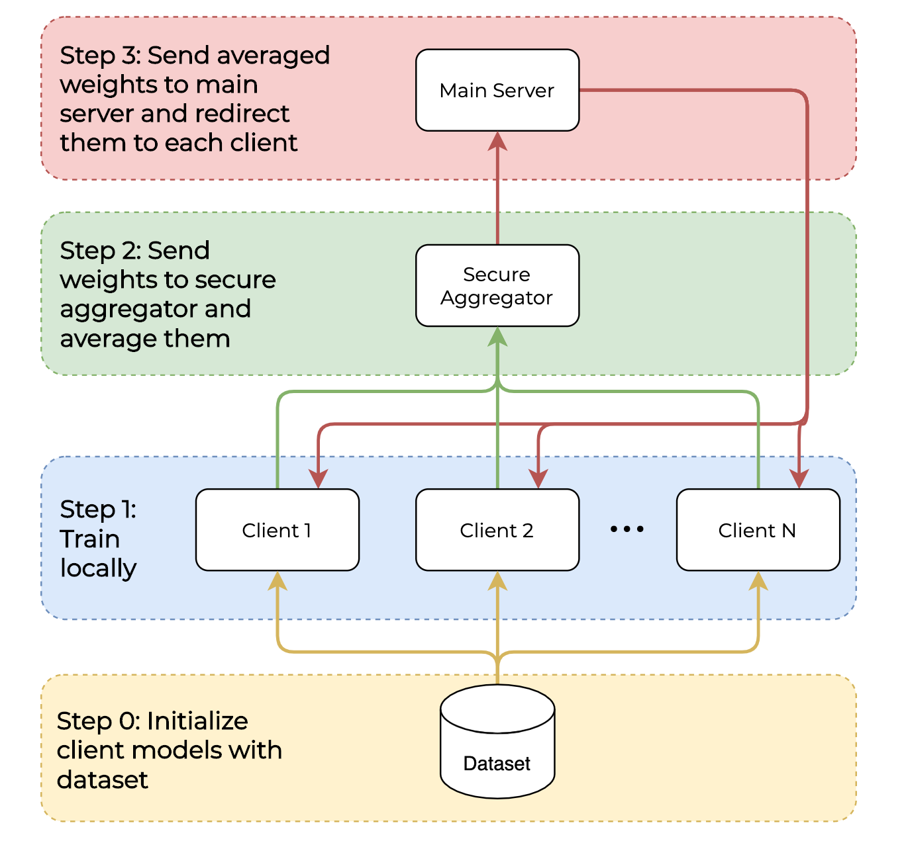
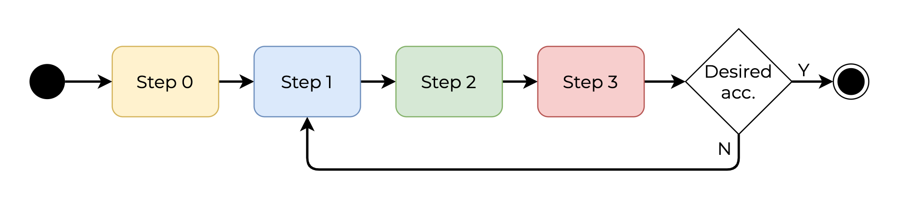

# Pytorch Federated Learning
This framework enables to use a FL system with Pytorch.

It is being carried as my final thesis @ [King's College London](https://www.kcl.ac.uk/).

It currently works with the [Human grasp dataset](http://stag.csail.mit.edu/). Repo [here](https://github.com/Erkil1452/touch).

## Scheme



## How to run

### Step 1. Copy the dataset locally

- Run the following commands:
    ```
    wget http://stag.csail.mit.edu/datasets/classification_lite.zip -O temp.zip
    unzip temp.zip -d data/classification/
    rm temp.zip
    ```

### Step 2. There are two main ways to run the program

- Spawning Python processes manually.
    - Spawn the main server by running: `python main_server/app.py -p 8000`
    - Spawn the secure aggregator by running: `python secure_aggregator/app.py -p 8001`
    - Spawn N clients by running: `python client/app.py -p 800<i+3>` where i is the client number (from 0 to N)

- Using Docker:
    - Create the image by running: `make build`.
    - Run the image: `make run`. This will spawn the main server, secure aggregator and two clients. In order to increase the number of clients, modify the docker-compose.yml and hosts.yml files.


## TODO
- [X] Create an 'orchestrator' with a frontend to manage all the connections and processes.
- [ ] Make proper documentation explaining how to select *no split*, *IID* or *NON-IID* dataset distributions
- [ ] Repeat experiments with 10 clients
