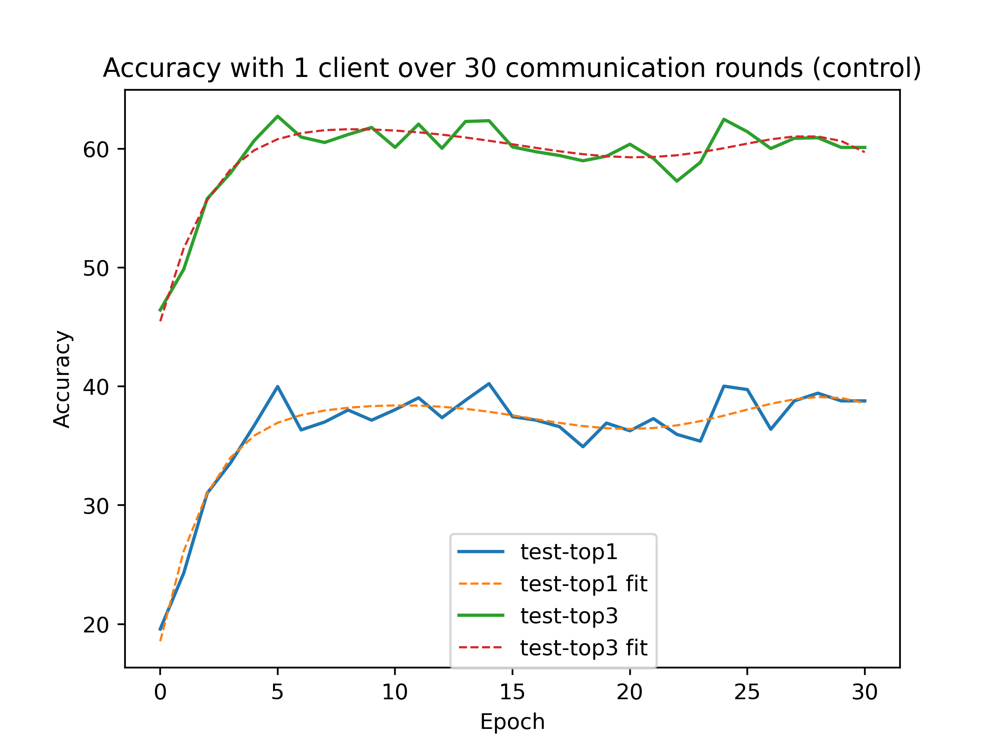
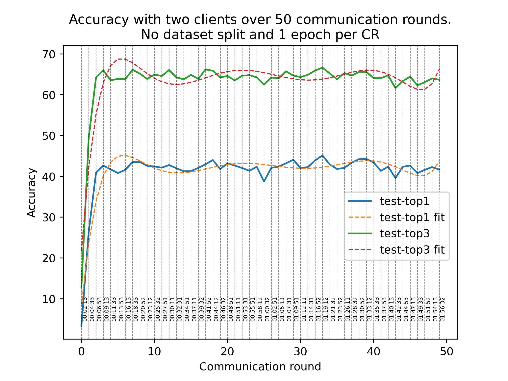
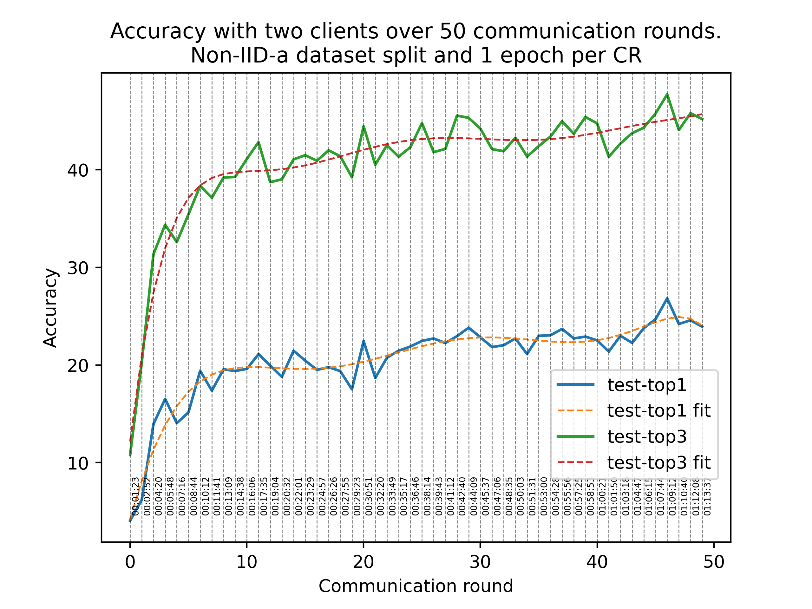
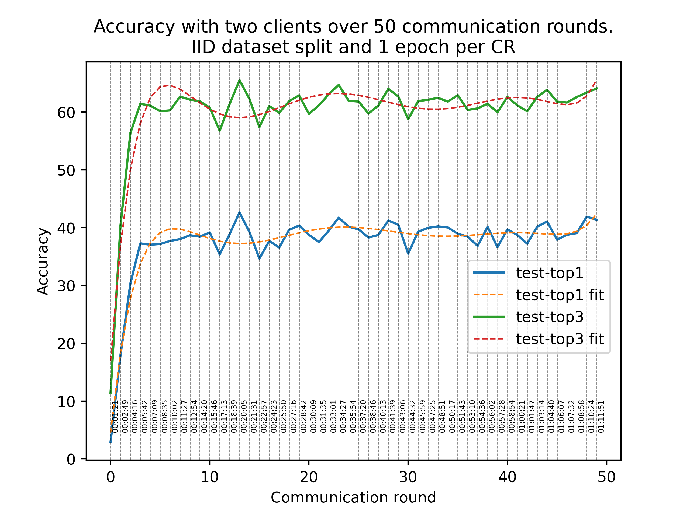
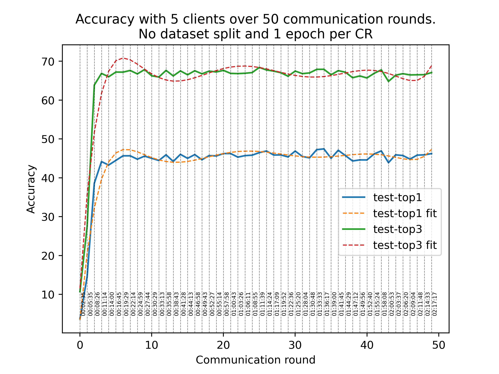
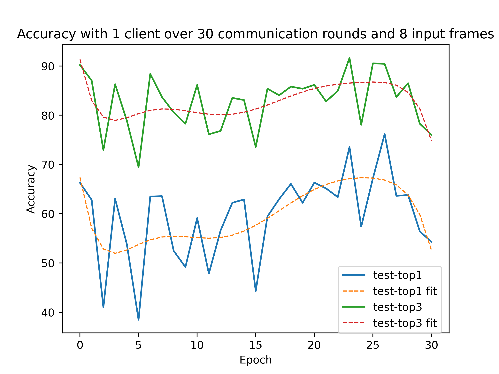
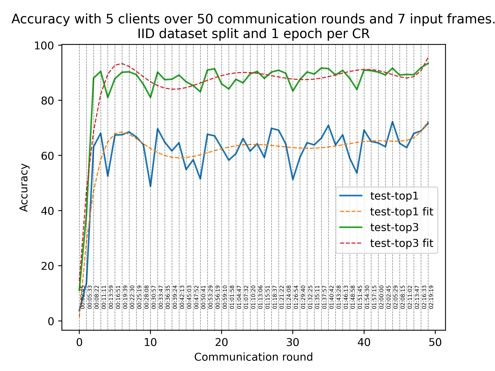
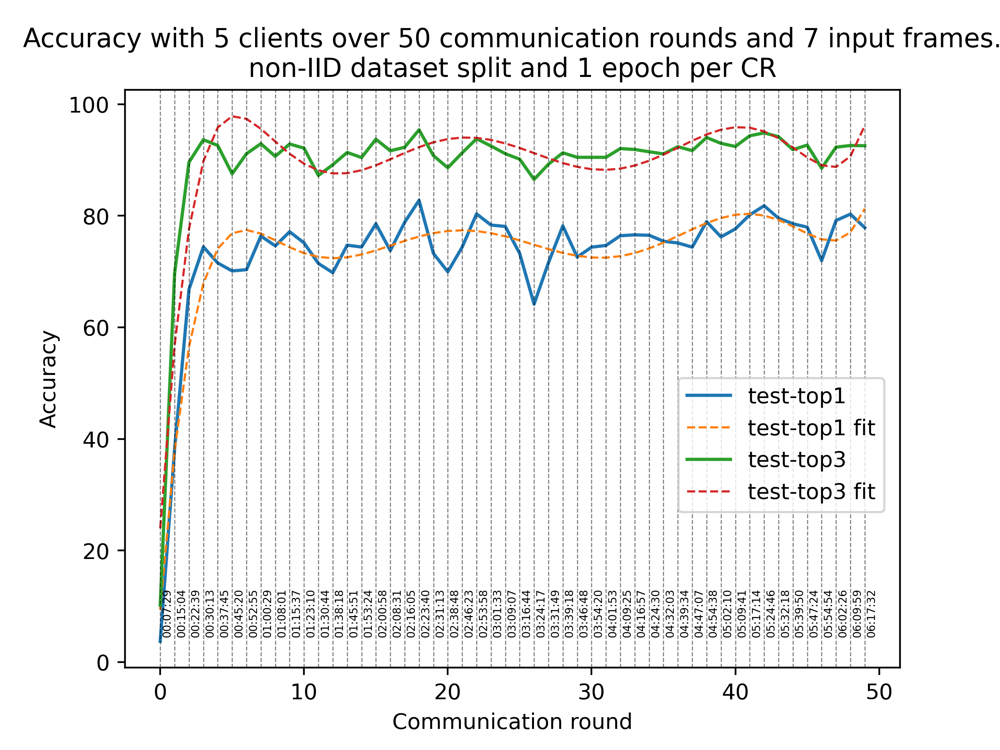
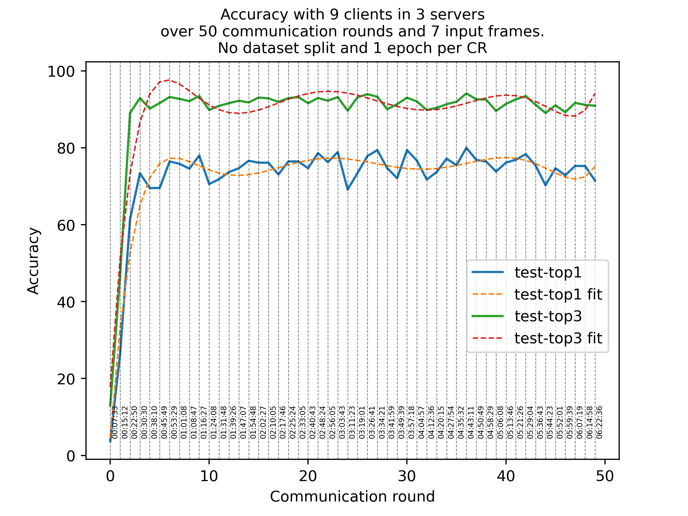

# Experimental results

## Experiment 0: Accuracy with one client over 30 communication rounds (No Federated Learning applied / control)

## Experiment 1: Accuracy with two clients over 50 communication rounds. No dataset split and 1 epoch per CR

## Experiment 2: Accuracy with two clients over 50 communication rounds. Non-IID-a dataset split and 1 epoch per CR

## Experiment 3: Accuracy with two clients over 50 communication rounds. IID dataset split and 1 epoch per CR

## Experiment 4: Accuracy with 5 clients over 50 communication rounds. No dataset split and 1 epoch per CR

## Experiment 5: Accuracy with 9 clients in 3 servers over 50 communication rounds. No dataset split and 1 epoch per CR

## Experiment 6: Accuracy with one client over 30 communication rounds and 7 input frames (No Federated Learning applied / control)

## Experiment 7: Accuracy with one client over 30 communication rounds and 8 input frames (No Federated Learning applied / control)

## Experiment 8: Accuracy with 5 clients over 50 communication rounds and 7 input frames. No dataset split and 1 epoch per CR

## Experiment 9: Accuracy with 5 clients over 50 communication rounds and 7 input frames. IID split and 1 epoch per CR

## Experiment 10: Accuracy with 5 clients over 50 communication rounds and 7 input frames. Non-IID-a split and 1 epoch per CR

## Experiment 11: Accuracy with 9 clients in 3 servers over 50 communication rounds and 7 input frames. No dataset split and 1 epoch per CR

