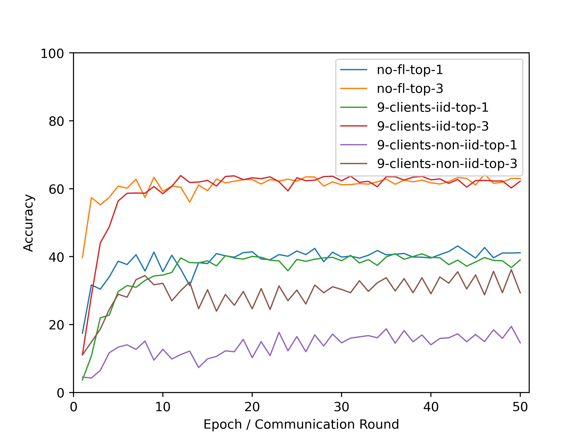
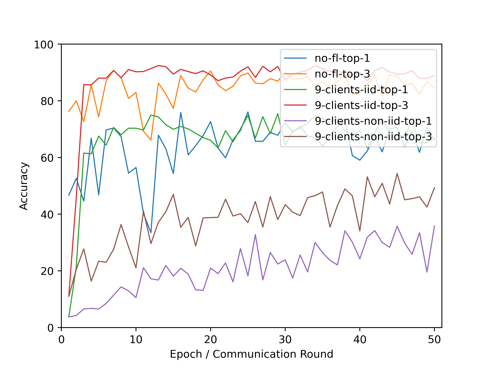
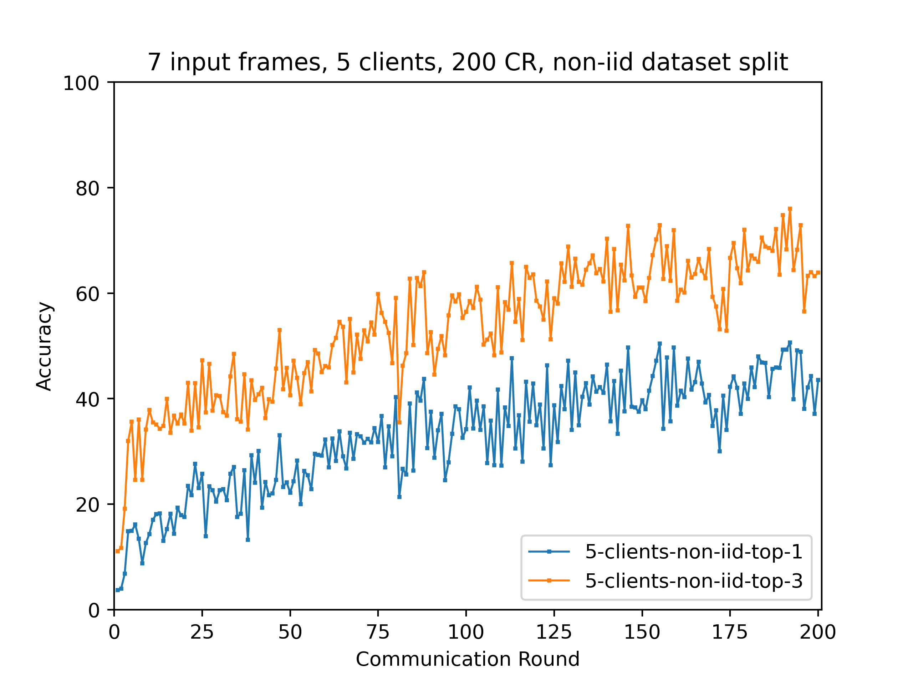

# Experimental results

## Experiment 1: 1 input frame with 1 and 5 clients

## Experiment 2: As the non-iid seemed like it was following a trend, here are the non-iid results with 200 CR

## Experiment 3: 7 input frames with 1 and 5 clients

## Experiment 4: As the non-iid seemed like it was following a trend, here are the non-iid results with 200 CR

